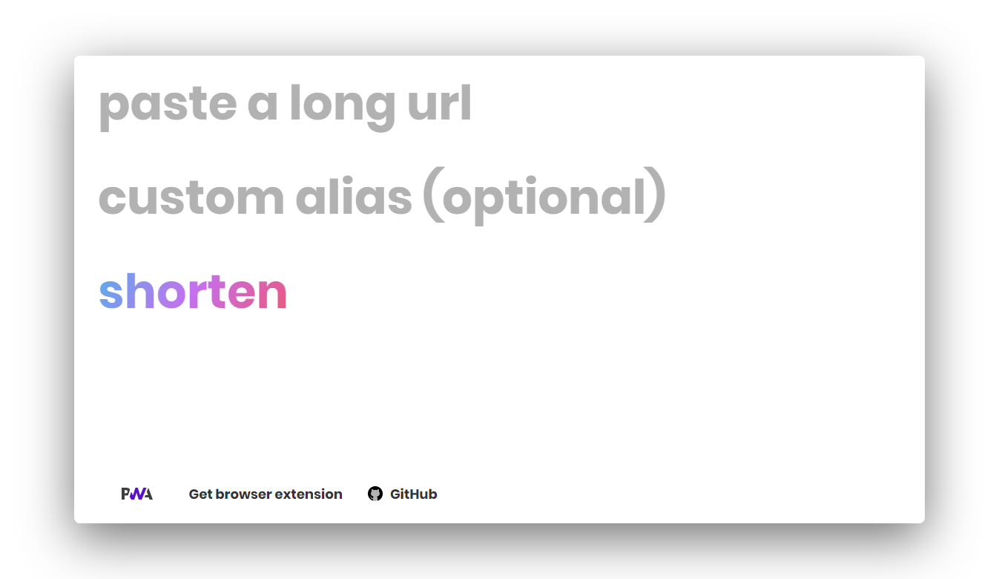
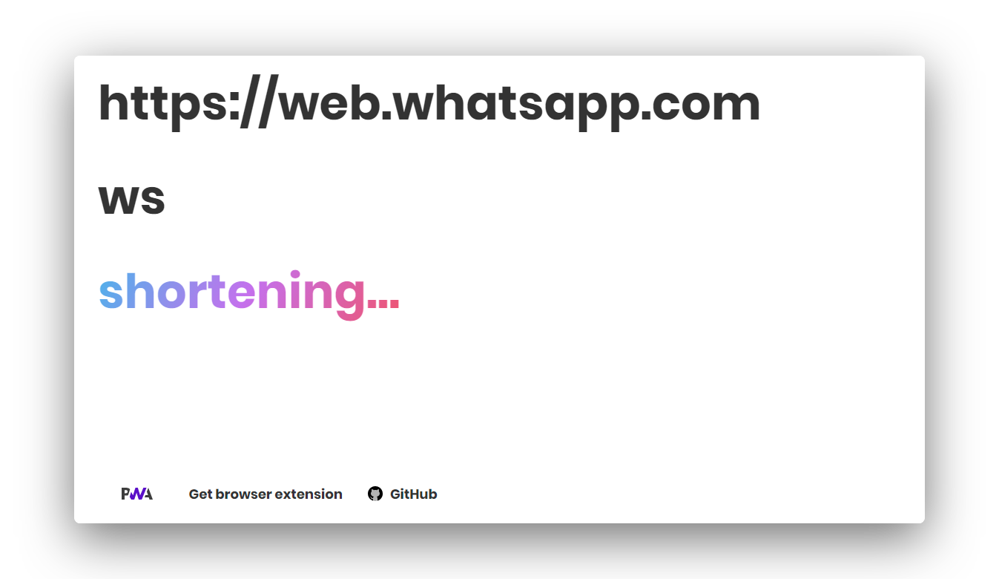

#  mnmlurl

### :link: Minimal URL is a modern URL shortener with support for custom alias by [Nikhil Vytla](https://github.com/Lolz1243) and [Liyas Thomas](https://github.com/liyasthomas)

   
  
  
   

### Features :sparkles:

:heart_eyes: **URL shortning made simple**: mnmlurl uses [jsonstore.io](https://www.jsonstore.io) to  store data on an endpoint JSON file using HTTPS requests. It works on any url.

:heart: **No server side logging**: Your privacy is important for us. We never log, collect or prompt to sell your data to anyone.

:fire: **Custom and random alias support**: Add your own custom alias or generate a random one.

:zap: **Performance**: mnmlurl is a thin web app on top of HTML, CSS and JavaScript. Being a Progressive Web App, mnmlurl offers lightning fast loading and offline support via workbox and service worker.

:information_desk_person: **Browser extension**:  Get mnmlurl [Chrome browser extension](https://github.com/liyasthomas/mnmlurl-extension)

---

## Built with

* HTML - For the web framework
* CSS - For styling components
* **[Chromium](https://github.com/chromium/chromium)** - Thanks for being so fast!

---

## Continuous Integration

We use [Travis CI](https://travis-ci.com) for continuous integration.

---

## Versioning

This project is developed by [Nikhil Vytla](https://github.com/Lolz1243) and [Liyas Thomas](https://github.com/liyasthomas) using the [Semantic Versioning specification](https://semver.org). For the versions available, see the [releases on this repository](https://github.com/liyasthomas/mnmlurl/releases).

---

## Authors

### Lead Developers
* [**Liyas Thomas**](https://github.com/liyasthomas) - *Author*
* [**Nikhil Vytla**](https://github.com/Lolz1243) - *Author*

### Testing and Debugging
* [Liyas Thomas](https://github.com/liyasthomas)

### Contributors
* [Nikhil Vytla](https://github.com/Lolz1243)
* [Liyas Thomas](https://github.com/liyasthomas)

---

## License

This project is licensed under the [MIT License](https://opensource.org/licenses/MIT) - see the [LICENSE](LICENSE) file for details.

---

## Change log

See the [CHANGELOG](CHANGELOG.md) file for details.

---

## Acknowledgments

* Hat tip to anyone who's code was used
* Inspirations:
	* [Glitch](https://glitch.com)
	* [tiny.cc](https://tiny.cc)
